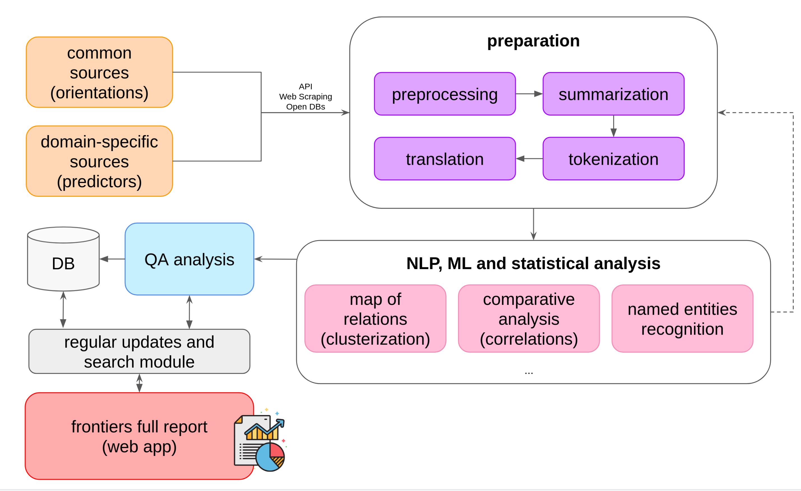

# Hack Frontiers Pipeline

---

A prototype of a system for defining frontiers of science for a Russian hackathon ["Цифровой прорыв"](https://leadersofdigital.ru/event/63008/case/704308).

---

## Tech Stack

**Python data manipulation:**
- pandas
- investpy (investments analysis)
- beautifulSoup4 (web-scraping)
- pytrends (google trends)

**NLP, ML and Statistics tools:**
- nltk
- gensim
- tokenizers (hugging face)
- transformers (hugging face)
- pytorch
- scikit-learn

**Back-end:**
- fast-api
- sqlalchemy
- postgresql
- airflow

**Front-end:**
- react.js
